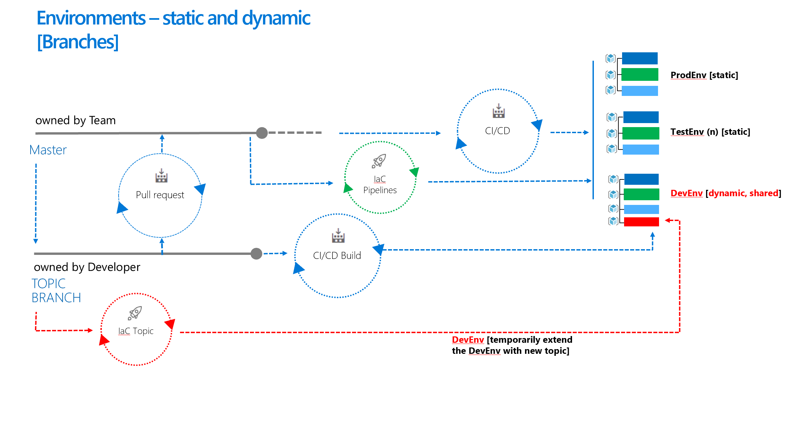
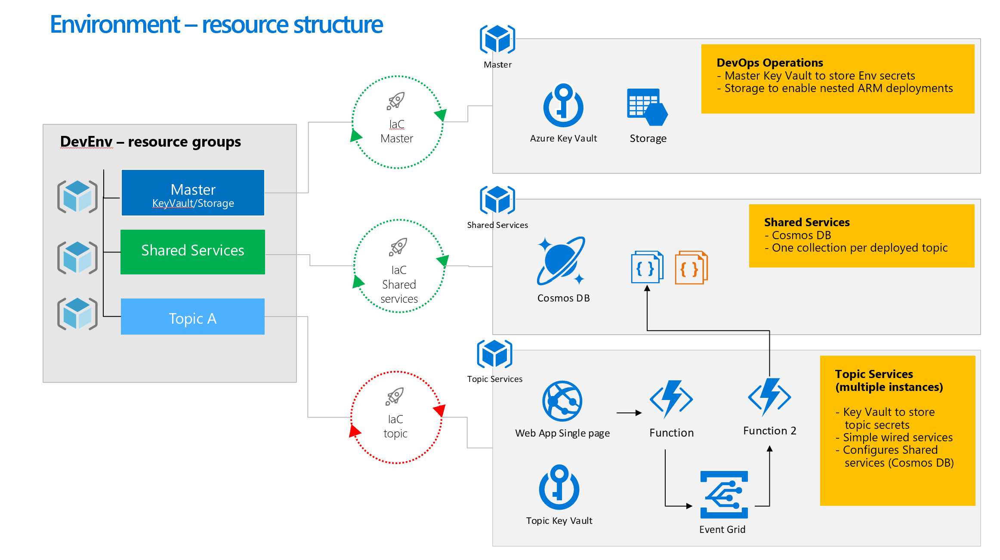
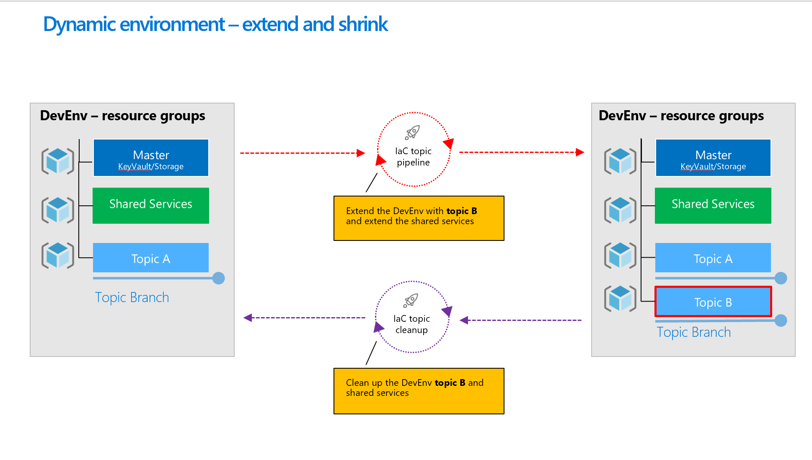
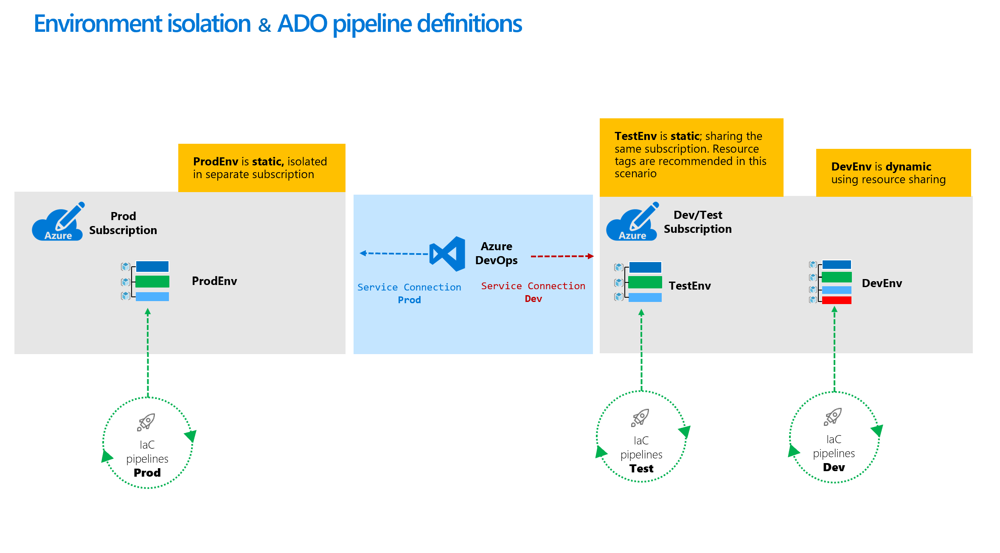
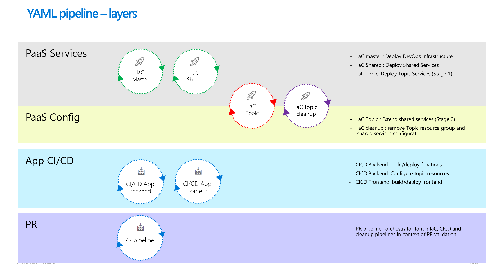
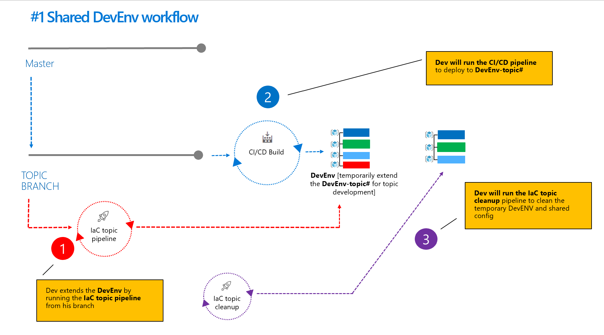
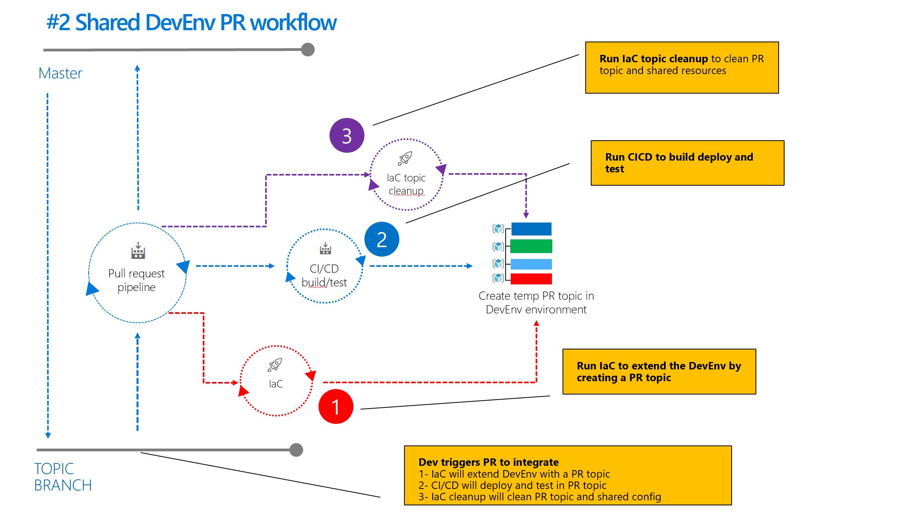
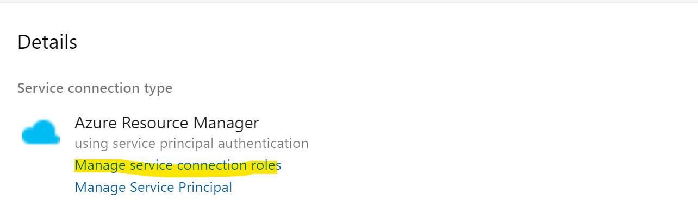
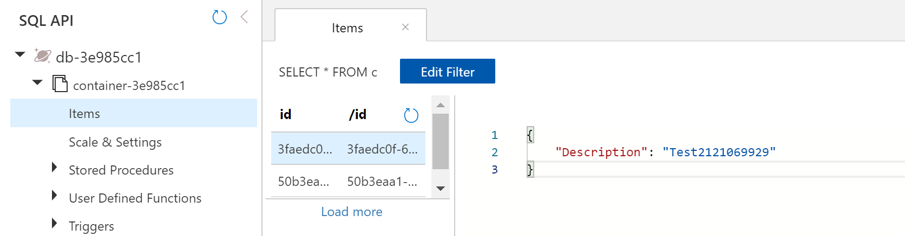
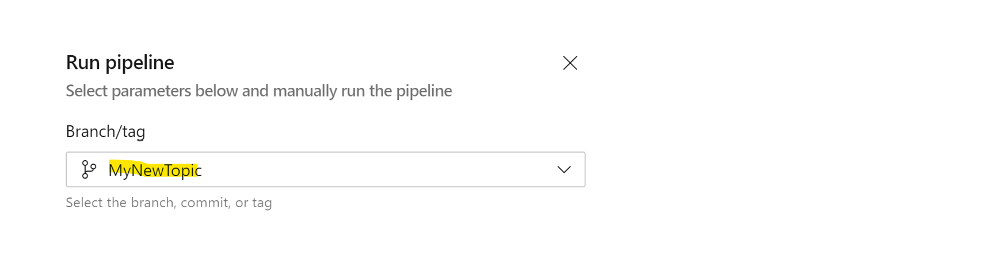

# Introduction 

  [Fast forward -  jump directly to the *Getting started* section](#getting-started)

The purpose of this project is to provide a basic set of ADO pipelines to setup a dynamic environment using PaaS services. The pipelines will demonstrate a pattern to extend the environment for parallel isolated workstreams and shrink it after the work is finished.

The solution consists of interconnected PaaS services. The requirement is to have mulitple isolated environments in parallel. All environments need to be deployed via IaC in this case using ARM but this could be Terraform as well.

A sample solution is part of the project to demonstrate the pattern and play with it.

## **Static versus Shared environments**

To simplify matters, we have three environments Prod, Test and Dev for a PaaS services based solution. For complex solutions, the team needs to balance between cost of having multiple active environments in parallel and the associated OPEX, agility to create a new environment and complexity of the pipeline design.

Prod and Test are considered to be a static environment. A static environment is completely isolated. All resources are part of a dedicated Resource Group and none of its services is sharing resources between environments. This approach is always the preferred option with the least Ops complexity.

Imagine a Dev environment where multiple developers work in parallel and require an isolated environment to work in. Having multiple parallel isolated PaaS environments could be costly and the creation of an additional isolated workstreams should be fast as well. The idea is to have a dynamic environment which can be expanded and shrinked as needed to fulfill these requirements. So how to create and operate a shared, cost-effective environment that also guarantees some level of workstream isolation?

The Dev environment will consist of shared resources organized in a shared Resource Group and isolated resources organized in a topic Resource Group. The shared PaaS resources are typically more expensive to operate and take more time to deploy, but also have the capability to isolate resources in its own context like CosmosDB collections. 



## **Environment resource structure** 

We are using the following resource structure for an environment - separating resources in three resource groups:

- *Master*,  contains all Ops related resources for the environment
- *Shared services*, contains all shared PaaS resources
- *Topic*, contains all isolated topic PaaS resources

For each resource group a dedicated IaC pipline will deploy the resources. For static and dynamic environments the structure is the same, allowing us to re-use the yaml code for all environments. 



Our sample consists of a Web frontend calling an Azure function. The function is creating an event and send it to the Event Grid. The second function has subscribed to the event and will write data to Cosmos DB. Cosmos DB is a shared resource, for each topic there is a dedicated collection. Web app, Azure functions and Event Grid are topic resources.

## **Dynamic environment lifecycle**

Managing the dynamic expansion of the environment is adding complexity to the pipeline design, as we need to take care of the expansion and cleanup to guarantee consistency of the environment. The topic lifecycle is managed by the IaC topic pipeline which will extend the environment and the IaC topic cleanup to shrink it:



## **Environment isolation**

To operate multiple environments using this pattern, we can isolate an environment in a separate Azure subscription or we can operate multiple environments in a subscription isolated by resource groups. The following diagram is showing some options, which can be applied as needed. 



The ProdEnv is isolated in the Prod Subscription as a static environment. Dev/TestEnv is sharing the same subscription, where DevEnv is a dynamic environment. Please note that we would need to create different ADO pipeline definitions for each environment but using the same yaml code. This could be achieved by setting the target environment and ADO service connection in the pipeline definition.

## **Pipeline overview**

The pattern is using a set of pipelines we structured by layers. Focus are the IaC pipelines, the PaaS Services and PaaS Config. The App CI/CD pipelines are part of the project to deploy our sample solution. The PR orchestrator pipeline and its corresponding workflow will be added later.



## **Dynamic Dev workflow**

There are two workflows we would like to showcase. 
1) *The dynamic Dev workflow*
1) *The dynamic pull request workflow*



The dynamic Dev workflow provides the developer the ability to extend the DevEnv with temporary resources for his topic development using the following flow:

1) dev creates his topic branch for his new work
1) dev runs the *IaC topic pipeline* from the topic branch to extend the DevEnv with the topic resources
1) dev works on the topic branch and deploys new code via App CI/CD pipelines to the resources to verify changes
1) dev integrates changes to master
1) after successful integration dev runs the *IaC topic cleanup pipeline* to remove topic resources 

## **Dynamic pull request workflow**

The dynamic pull request workflow provides the ability to extend the environment as part of a PR and validate the changes against the resources before integrating into master. The PR pipeline will need to orchestrate and execute the different pipelines as needed and finally cleanup the resources.

**Note : in current repo we have not provided the PR pipeline yet. We plan to add the pipeline as part of the next update**



# Getting started

1) Create ADO project using Git - [Create project](https://docs.microsoft.com/en-us/azure/devops/organizations/projects/create-project?view=azure-devops&tabs=preview-page)
1) Import this Git repo - [Import Repo](https://docs.microsoft.com/en-us/azure/devops/repos/git/import-git-repository?view=azure-devops)
1) Add ADO Task ReplaceTokens to your ADO Project [ReplaceTokens](https://marketplace.visualstudio.com/items?itemName=qetza.replacetokens)
1) Create a AzureServiceConnection in ADO - [Add Azure RM connection](https://docs.microsoft.com/en-us/azure/devops/pipelines/library/service-endpoints?view=azure-devops&tabs=yaml) 

   > **Important -** The SPN created by the AzureServiceConnection in ADO requires the **Owner role** on subscription level as the pipelines will configure RBAC resources. To configure the role open the AzureServiceConnection details in ADO and use ***Manage service connection roles*** link.
    

2) Configure the pipelines and create the first environment:
   - [IaC Master](#configure-and-run-the-iac-master-pipeline) 
   - [IaC Shared](#configure-and-run-the-iac-shared-pipeline)
   - [IaC Topic](#configure-and-run-the-iaC-topic-pipeline)
   - [IaC Topic cleanup](#configure-the-iac-topic-cleanup-pipeline)
   - [CI/CD backend](#configure-and-run-the-ci/cd-backend-pipeline)
   - [CI/CD frontend](#configure-and-run-the-ci/cd-frontend-pipeline)

3) [Test out](#test-out-the-dynamic-dev-workflow) the dynamic Dev workflow 

## Configure and run the IaC Master pipeline

The **IaC-Master pipeline** will setup the Ops infrastructure and runs just once.

- Create the **IaC-Master pipeline** in ADO referencing the YAML ```\azure-pipelines\iac-master.yaml``` and name it IaC-Master
- Set minimum required variables in ```iac-master.yaml```

| **Variable**   | **Description** |
| -------- | ---------- |
| ```projName```    |  [max 8 chars] needs to be unique. Will be used to compose the Azure resource names. Needs to be the same for all IaC pipelines provisioning an environment  |
| ```azureServiceConnection``` | AzureServiceConnection name      |
| ```azLocation```| your Azure location       |

**Note**: If you are planning to use multiple environments you can set the variables at queue time and create a set of pipeline definitions per environment.

- Run the **IaC-Master pipeline** and verify the resources in the Azure portal:

| **Resource type** | **Name** | **Location** |
| -------- | ---------- |---------- |
|Resource Group| ```projName```-master  | Root
|KeyVault | master-```projName```-kv | ```projName```-master
|Storage account | master```projName```strg | ```projName```-master
**Notes**
- KeyVault is used to store all environment global secrets. The **IaC-Shared pipeline** will write the secrets there.
- The Storage account will be used to deploy nested ARM templates. The pipeline design for **IaC-Shared** and **IaC-Topic** are supporting nested ARM templates.

## Configure and run the IaC Shared pipeline

The **IaC-Shared pipeline** pipeline will deploy all shared PaaS services

- Create the **IaC-Shared pipeline** in ADO referencing the YAML ```\azure-pipelines\iac-shared.yaml``` and name it IaC-Shared
- Set minimum required variables in ```iac-shared.yaml``` 

| **Variable**   | **Description** |
| -------- | ---------- |
| ```projName```    |  [max 8 chars] needs to be unique. Will be used to compose the Azure resource names. Needs to be the same for all IaC pipelines provisioning an environment  |
| ```azureServiceConnection``` | AzureServiceConnection name      |
| ```azLocation```| your Azure location       |

-  Run the **IaC-Shared pipeline** and verify the resources in the Azure portal:

| **Resource type** | **Name** | **Location** |
| -------- | ---------- |---------- |
|Resource Group| ```projName```-shared  | Root
|CosmosDB| shared-```projName```-cosmos | ```projName```-shared
**Notes**
- Our sample solution is using CosmosDB as shared service.
- Extend this pipeline if you like to add other shared services.

## Configure and run the IaC Topic pipeline

The **IaC-Topic pipeline** will deploy all PaaS services for a topic. When running the pipeline you choose the branch you would like to work on and extend the environment. For the initial deployment you choose Master as branch, which will give us the basic environment. Creating additional isolated workstreams in this environment is as easy as running the **IaC-Topic pipeline** based on the desired topic branch.

- Create the **IaC-Topic pipeline** in ADO referencing the YAML ```\azure-pipelines\iac-topic.yaml``` and name it IaC-Topic
- Set minimum required variables in ```iac-topic.yaml``` 

| **Variable**   | **Description** |
| -------- | ---------- |
| ```projName```    |  [max 8 chars] needs to be unique. Will be used to compose the Azure resource names. Needs to be the same for all IaC pipelines provisioning an environment  |
| ```azureServiceConnection``` | AzureServiceConnection name      |
| ```azLocation```| your Azure location       |

- Run the **IaC-Topic pipeline** from branch Master and verify the resources in the Azure portal.

| **Resource type** | **Name** | **Location** |
| -------- | ---------- |---------- |
|Resource Group| ```projName```-topic-```branchName```  | Root
|App Service| ```projName```-```branchHash```-func | ```projName```-topic-```branchName``` 
|App Service| ```projName```-```branchHash```-webapp | ```projName```-topic-```branchName``` 
|App Service plan| ```projName```-```branchHash```-funcplan | ```projName```-topic-```branchName``` 
|App Service plan| ```projName```-```branchHash```-webplan | ```projName```-topic-```branchName```
|KeyVault| ```projName```-```branchHash```-kv | ```projName```-topic-```branchName``` 
|Event Grid topic| projName```branchHash```eg| ```projName```-topic-```branchName``` 
|Storage account| projName```branchHash```funcstrg| ```projName```-topic-```branchName``` 

**Notes**

- The ```branchHash``` is 8 chars long and will be created from the branch name by the pipeline. 
- App Services is hosting the Azure Functions and the Web app frontend of the sample solution.
- Storage account is required by Azure functions.
- The topic KeyVault stores all secrets for the topic instance related resources.
- Event Grid will be used by the solution to manage events between Azure functions.

## Configure the IaC Topic cleanup pipeline

The **IaC-Topic cleanup pipeline** will delete the topic resource group and the shared configuration in CosmosDB. You run the pipeline from your topic branch to clean topic resources in the shared environment. Extend this pipeline if you are adding more shared services to your environment.

- Create the **IaC-Topic cleanup pipeline** in ADO referencing the YAML ```\azure-pipelines\cleanup-topic.yaml```  and name it IaC-TopicCleanup
- Set minimum required variables in ```cleanup-topic.yaml``` :

    | **Variable** | **Description** |
    | -------- | ---------- |
    | ```projName``` | [max 8 chars] needs to be unique. Will be used to compose the Azure resource names. Needs to be the same for all IaC pipelines provisioning an environment  |
    | ```azureServiceConnection``` | AzureServiceConnection name |
    
## Configure and run the CI/CD backend pipeline

The **CI/CD backend pipeline** will build and deploy all functions and create the Event Grid topic subscription.

- Create the **CI/CD backend pipeline** in ADO referencing the YAML ```\azure-pipelines\CICD-backend.yaml``` and name it CICD-Backend
- Set minimum required variables in ```CICD-backend.yaml``` :

    | **Variable** | **Description** |
    | -------- | ---------- |
    | ```projName``` | [max 8 chars] needs to be unique. Will be used to compose the Azure resource names. Needs to be the same for all IaC pipelines provisioning an environment  |
    | ```azureServiceConnection``` | AzureServiceConnection name |

- Run the **CI/CD backend pipeline** from branch Master.
  
## Configure and run the CI/CD frontend pipeline

The **CI/CD frontend pipeline** will build and deploy the web frontend.

- Create the **CI/CD frontend pipeline** in ADO referencing the YAML ```\azure-pipelines\CICD-frontend.yaml``` and name it CICD-Frontend
- Set minimum required variables in ```CICD-fronted.yaml``` :

    | **Variable** | **Description** |
    | -------- | ---------- |
    | ```projName``` | [max 8 chars] needs to be unique. Will be used to compose the Azure resource names. Needs to be the same for all IaC pipelines provisioning an environment  |
    | ```azureServiceConnection``` | AzureServiceConnection name |

- Run the **CI/CD fronted pipeline** from branch Master. 
- Test the solution - Open the Azure portal :

  **Home > Resource groups > ```projName```-topic-```branchName``` >
```projName```-```branchHash```-webapp**

- Get the Webapp Url and open it and generate an Event by hitting the button:

  

- Verify that Event has been saved to CosmosDB. Open the Azure portal : 

  **Home > Resource groups > ```projName```-shared >
  shared-```projName```-cosmos | Data Explorer**

- Data Explorer : open database *db-```branchHash```* and list all items in the container. For each Event there should be an item logged with "Description": "TestXXXXXXXX". Please note that for each topic instance there is a separate database using the convention *db-```branchHash```*

  

## Test out the dynamic Dev workflow

To test out the dynamic Dev flow we assume you finished the *Getting started* section. Your complete base environment should look like this in Azure:

| **Resource type** | **Name** | **Location** |
| -------- | ---------- |---------- |
|Resource Group| ```projName```-master  | Root
|Resource Group| ```projName```-shared  | Root
|Resource Group| ```projName```-topic-master | Root

- To extend the environment by a workstream we need to create a new topic branch first
- Running the *IaC topic pipeline* from the new Topic branch will extend the environment.
  
   

  as a result the environment will look like this:

  | **Resource type** | **Name** | **Location** |
  | -------- | ---------- |---------- |
  |Resource Group| ```projName```-master  | Root
  |Resource Group| ```projName```-shared  | Root
  |Resource Group| ```projName```-topic-master | Root
  |Resource Group| ```projName```-topic-```MyNewTopic```  | Root

- Running the *CI/CD backend and frontend pipelines* from the topic branch *MyNewTopic* will deploy the solution. Now you can do your code changes and redeploy using the *CI/CD backend and frontend pipelines* as needed. 

  **Note**  In case your changes require new PaaS resources you need to update ARM templates and pipelines as needed.

- When you finish your work integrate to master.
- Finally run the *IaC topic cleanup pipeline* for the *MyNewTopic* branch to remove resources from the environment. As a result the environment looks like this:

  | **Resource type** | **Name** | **Location** |
  | -------- | ---------- |---------- |
  |Resource Group| ```projName```-master  | Root
  |Resource Group| ```projName```-shared  | Root
  |Resource Group| ```projName```-topic-master | Root
